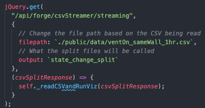

# COVID-BIM-V2

The CSV files are too large to upload on github, if you need to run this project please email Dr. Vinu Subashini Rajus at vinu.rajus@carleton.ca

## Getting Started

###### Clone the repository

###### Get dependencies

```npm install```

```npm i -S fast-csv```

```npm install csv-split-stream```

###### Make a Forge Account

[Autodesk Forge](https://forge.autodesk.com/)

###### Use Forge Credentials to Run the Application

See ```launch.json``` in the ```.vscode``` folder. Enter your client ID and secret there. 

###### Convert Simulation Results to CSV

Place your ```state.txt``` file into the ```scripts``` folder, then cd into the ```scripts``` folder and run the following command in terminal: 

```cat state.txt | python state_txt_to_csv-VCP.py```

This will output ```state_change.csv```

###### Create Folder(s) for Simulation Data

Create a folder in ```public``` called ```data``` and store your ```state_change.csv``` there. Next, create a folder in the ```data``` folder called ```output```. This is where the split CSVs will be stored.

## Things to Watch out for

- The filepath of the CSV being read (see ```extraExtension.js```)
  
  

- Solving the number of cells in a time step depends on the time steps in the data
  
  

- Visualization playback
  - The ```time``` variable: How often to read a new CSV file
  - The ```speed``` variable: Reduces the number of files to read
    - Ex. If the speed is 10 then only every 10th CSV file will be read
- Find the max state in a cell through ```csvStreamer.js``` and update this.maxState in ```extraExtension.js```

  
  
- ```csvStreamer.js``` has ```req.setTimeout(0)``` for users with slow computers. Remove the timeout callback when running the application outside of localhost. 

## Plans for the Future

- Look into flags for WebGL errors
- Solve how to find max number of viral particles without slowing things down
- Save ```state_change.csv``` to ```public/data``` automatically after running Python script?
- Stop sprites / icons from changing size when zooming in or out
  - Could potentially be done through the size parameter in the shader

## Important Links

[Cadmium simulator](https://github.com/SimulationEverywhere/Cell-DEVS-Cadmium-Simulation-Environment)

[CO2 model](https://github.com/SimulationEverywhere-Models/Cell-DEVS-CO2_spread_computer_lab)

[Indoor Virus Spread model](https://github.com/SimulationEverywhere-Models/indoor_virus_spread)

[BIM-to-DEVS](https://github.com/SimulationEverywhere/BIM-to-DEVS/tree/master)

### Resources

[Graphics reference for shaders](http://what-when-how.com/Tutorial/topic-1779u1aung/Three-js-277.html) - Explains types of qualifiers (uniform, varying, etc.)

[gl_FragCoord](https://www.khronos.org/registry/OpenGL-Refpages/gl4/html/gl_FragCoord.xhtml) - Might help with camera view of sprites / icons

[Data Types (OpenGL)](https://www.khronos.org/opengl/wiki/Data_Type_(GLSL)https://www.khronos.org/opengl/wiki/Data_Type_(GLSL)) - Scalars and vectors

[3D Markup with icons and info-Card](https://forge.autodesk.com/blog/3d-markup-icons-and-info-card) - Discusses spritesheets and clickable geometries

[Using PointCloud in Forge Viewer](https://forge.autodesk.com/blog/using-pointcloud-forge-viewer) - Uses three.js (r71)

[Fast-CSV](https://c2fo.io/fast-csv/) - CSV Parser and Formatter

[csv-split-stream](https://www.npmjs.com/package/csv-split-stream) - Split a CSV read stream into multiple write streams

[File stream](https://nodejs.org/api/stream.html#stream_readable_pause) - Node.js stream readable

### Other Resources 

[Michael Beale](https://forge.autodesk.com/author/michael-beale)

[Basic Skeleton Extension](https://learnforge.autodesk.io/#/viewer/extensions/skeleton)

[Handle Selection Extension](https://learnforge.autodesk.io/#/viewer/extensions/selection)

[Basic PointClouds in Forge Viewer](https://forge.autodesk.com/blog/basic-point-clouds-forge-viewer)

[Consume AEC Data](https://forge.autodesk.com/blog/consume-aec-data-which-are-model-derivative-api)

[2D Minimap](https://forge.autodesk.com/blog/add-revit-levels-and-2d-minimap-your-3d) 

[Set Theming Color](https://forge.autodesk.com/blog/happy-easter-setthemingcolor-model-material)

[Forge Fader](https://github.com/jeremytammik/forgefader)

[Forge Heat Map Extension](https://github.com/petrbroz/learn.forge.viewmodels/blob/extend-viewer/public/js/HeatmapExtension.js)

[Custom Shader Materials in Forge Viewer](https://forge.autodesk.com/blog/custom-shader-materials-forge-viewer)

[Forge PointCloud Animation](https://github.com/wallabyway/forge-pointcloud-animation)

[Custom Model Browser](https://forge.autodesk.com/blog/customizing-model-browser-custom-label-behavior-styling-and-data-sources)

[Dynamic Textures on Flat Surface](https://adndevblog.typepad.com/cloud_and_mobile/2016/07/projecting-dynamic-textures-onto-flat-surfaces-with-threejs.html)

[SVF2 Public Beta](https://forge.autodesk.com/blog/svf2-public-beta-new-optimized-viewer-format)

[SFV Extractor](https://forge.autodesk.com/blog/forge-svf-extractor-nodejs)

[Forge Fader](https://forge-rcdb.autodesk.io/configurator?id=59041f250007f5c0eef482f2)

[HTTP Live Streaming](https://developer.apple.com/streaming/)

[M3U8 File for HTTP Live Stream](https://www.lifewire.com/m3u8-file-2621956#:~:text=A%20file%20with%20the%20M3U8,for%20an%20internet%20radio%20station.)

[OpenVDB for Particle-based Fluid Simulation](https://www.openvdb.org/)

[Forge Viewer Extract Spreadsheet](https://github.com/Autodesk-Forge/viewer-javascript-extract.spreadsheet)

[Forge APIs](https://forge.autodesk.com/en/docs/)

[THREE.js OBJLoader](https://threejs.org/docs/#examples/en/loaders/OBJLoader)

[Free OBJ Models for Viewer](https://www.turbosquid.com/3d-model/free/character?keyword=sitting)

[Woman Sitting OBJ](https://www.turbosquid.com/3d-models/free-max-mode-human-rig-female-gigapixel/847088)
